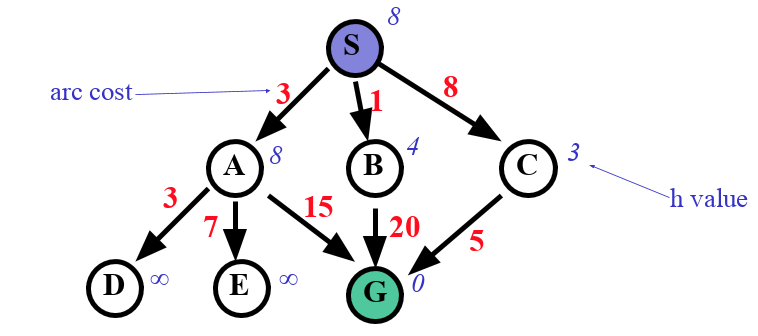

# AI-with-JS



## BFS (Breadth-first search)

```bash
[ 'S(0)' ]
[ 'A(3)', 'B(1)', 'C(8)' ]
[ 'B(1)', 'C(8)', 'D(6)', 'E(10)', 'G(18)' ]
[ 'C(8)', 'D(6)', 'E(10)', 'G(18)', 'G(21)' ]
[ 'D(6)', 'E(10)', 'G(18)', 'G(21)', 'G(13)' ]
[ 'E(10)', 'G(18)', 'G(21)', 'G(13)' ]
[ 'G(18)', 'G(21)', 'G(13)' ]
{ parent: 'A', pathCost: 18, value: 'G' }
==========BFS==========: 3.702ms
```
